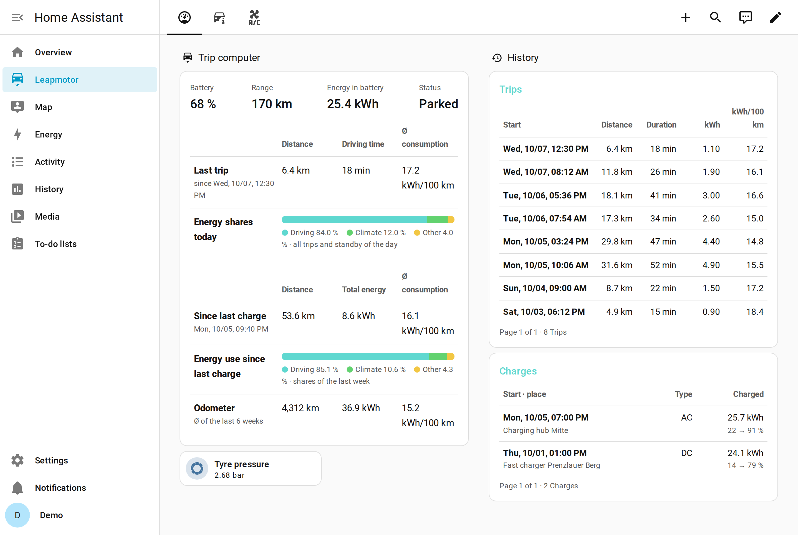
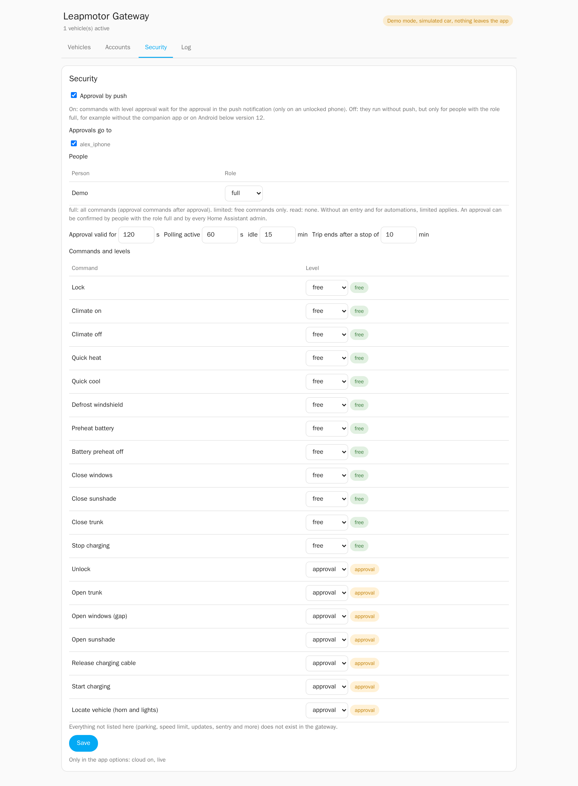
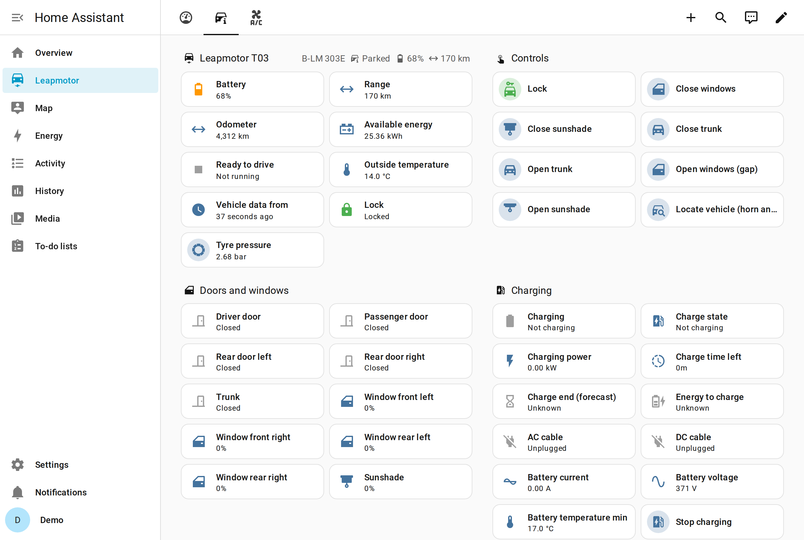
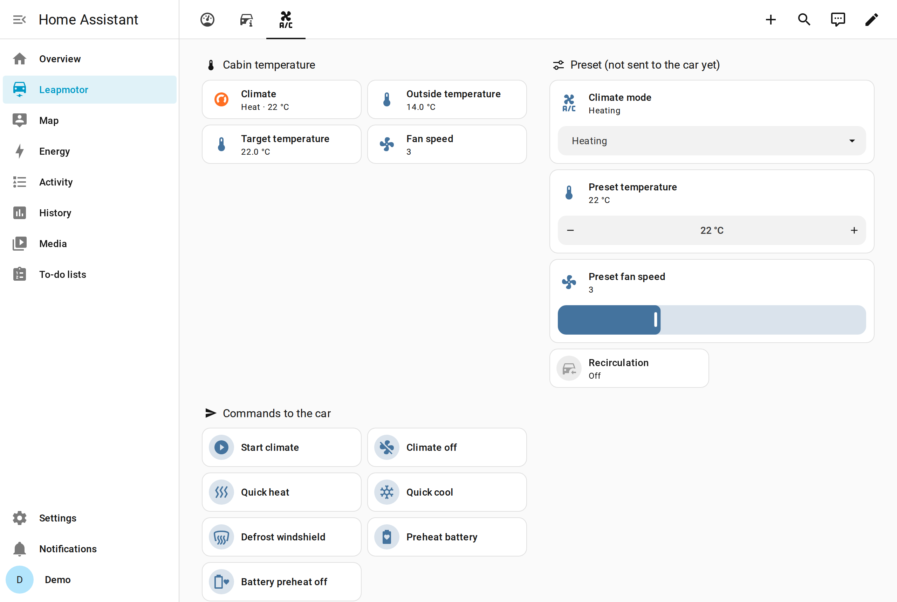
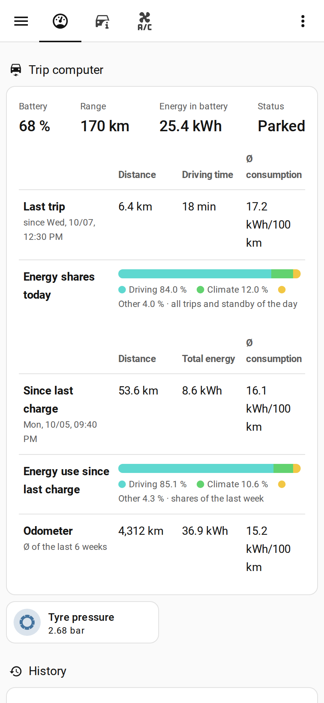
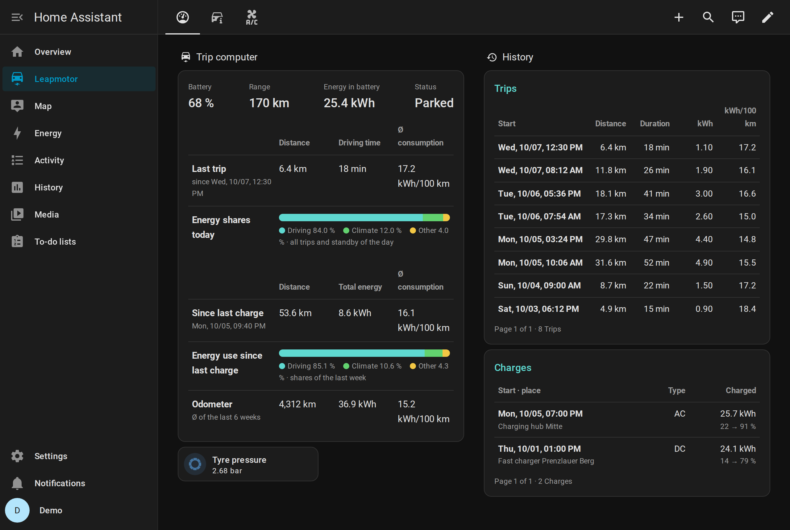
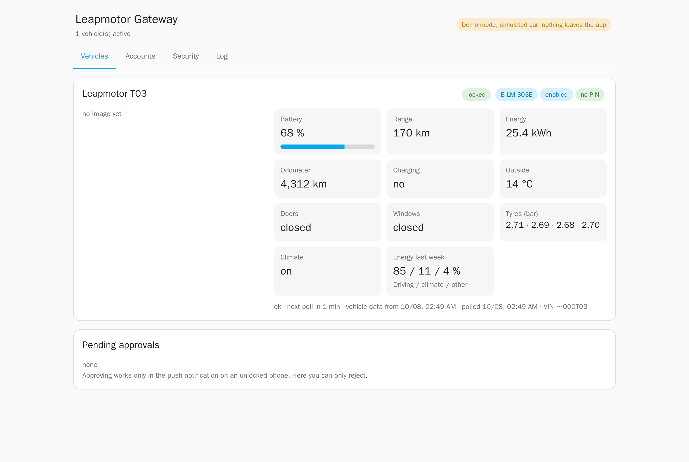

# Leapmotor Gateway for Home Assistant

[](https://github.com/helix-git/ha-leapmotor-gateway/actions/workflows/tests.yml)
[](https://github.com/helix-git/ha-leapmotor-gateway/actions/workflows/stack.yml)
[](https://github.com/helix-git/ha-leapmotor-gateway/actions/workflows/haos.yml)
[](https://github.com/helix-git/ha-leapmotor-gateway/actions/workflows/codeql.yml)
[](https://scorecard.dev/viewer/?uri=github.com/helix-git/ha-leapmotor-gateway)

[](LICENSE)

A Home Assistant app (add-on) with its own integration for Leapmotor electric cars, tested with
the T03. The app is the only component that talks to the Leapmotor cloud. Home Assistant reads
the car through it and sends every command through it.



## Control over critical commands

Every remote command passes an allowlist with three levels:

| Level | Meaning | Default for |
|---|---|---|
| free | runs immediately | lock, climate, quick heat or cool, defrost, battery preheat, close windows, sunshade and trunk, stop charging |
| approval | sends a push notification. The command runs only after it is approved on an unlocked phone. | unlock, open trunk, windows and sunshade, release charging cable, start charging, locate |
| blocked | never runs | any command you choose |

Commands that are not on the list do not exist in the gateway: parking, speed limit, software
updates and sentry mode among them.

Each Home Assistant user has a role:

| Role | May trigger |
|---|---|
| full | every command that is not blocked |
| limited | free commands only. Automations and unknown users are limited. |
| read | nothing |

Only users with the role full and Home Assistant admins can approve. Answers from anybody else
are ignored. Levels and roles are set in the app.



Further protection:

- The vehicle PIN is set only for the moment a command is sent.
- The same command at most every 10 seconds, at most 30 commands per hour, a refresh at most
  once per minute and vehicle.
- Every request is logged with its result.
- Dry run mode checks and logs commands without sending them.
- No exposed port. The interface is reachable only via Home Assistant ingress and only for admins.
- Own AppArmor profile. The service runs as its own user and cannot access the Home Assistant
  configuration. Only the install step at start runs as root, and AppArmor lets it write
  nothing but `custom_components/leapmotor_gateway`.

## What you get in Home Assistant

- Sensors for battery, range, odometer, doors, windows, tyres, charging, climate and more.
- Buttons, a climate entity and a lock, all bound to the allowlist.
- A device tracker for the car.
- Trip computer: trips and charges with distance, energy and consumption. A short move between
  two polls is recognised from the odometer.
- Charging forecast: end of charge and energy still to charge.
- A dashboard strategy. Add a dashboard, choose **Leapmotor** and it builds pages for trip
  computer, status, climate and tyres. No custom cards to install.

| Status | Climate |
|---|---|
|  |  |

| Phone | Dark theme |
|---|---|
|  |  |

## Installation

1. Add the app repository to Home Assistant and install **Leapmotor Gateway**:

   [](https://my.home-assistant.io/redirect/supervisor_add_addon_repository/?repository_url=https%3A%2F%2Fgithub.com%2Fhelix-git%2Fha-apps)

   Or add `https://github.com/helix-git/ha-apps` under **Settings > Apps > App store > Repositories**.
2. Start the app. It installs its integration into `custom_components` (no HACS needed) and asks
   for one restart of Home Assistant.
3. Open the app, add your Leapmotor account and upload the app certificate (see below).
4. Confirm the integration under **Settings > Devices & services > Discovered**.
5. Turn on `cloud_enabled`. Test with `dry_run` on, then turn it off.

The app copies its integration at every start when it has changed, and Home Assistant shows a
notification. Restart Home Assistant then. After the first installation, add the integration
under **Settings > Devices & services**, where it appears as discovered. The dashboard is added
in Home Assistant itself (**Settings > Dashboards**, strategy **Leapmotor**). Neither step needs
root.

### App certificate

The Leapmotor cloud requires a client certificate. It is not included. See
[leapmotor-api](https://github.com/markoceri/leapmotor-api) for how to obtain it.

### Demo mode

`demo_mode` replaces the cloud with a simulated T03 in Berlin. No account and no certificate are
needed and nothing leaves the app. Commands change the simulated car. All screenshots on this
page show the demo.



## Service

`leapmotor_gateway.command` triggers a command from scripts and automations:

```yaml
action: leapmotor_gateway.command
data:
  action: climate_on
  params:
    mode: hot
    temperature: 22
    fan_speed: 3
    recirculation: false
```

`vin` selects the car when there is more than one. A refused command raises an error with the
reason, for example `no permission (role limited)`.

## Limits

- Tested with the Leapmotor T03 only. Other models may report fields differently.
- Account password, vehicle PIN and certificate key are stored unencrypted in the app data
  folder, readable only by the app. This folder is part of every Home Assistant backup. Encrypt
  your backups.
- The integration API accepts requests only from 172.30.32.1 with a token from Supervisor
  discovery. Apps with host networking share that address, so the token is the actual
  protection.

## Interface language

English, with German translations for the app, the entities and the dashboard.

## Development

```sh
pip install --require-hashes -r .github/requirements/app.txt
cd addon && python -m pytest tests                 # app
python -m pytest                                   # integration, needs pytest-homeassistant-custom-component
python -m pytest tests_frontend                    # dashboard strategy, needs playwright
docker build -t lmgw-e2e-gateway addon && python e2e/run.py   # stack test with a real Home Assistant
```

What the tests check is described in [docs/testing.md](docs/testing.md).

## Thanks

- [markoceri/leapmotor-api](https://github.com/markoceri/leapmotor-api) for login, request
  signing and remote commands.
- [kerniger/leapmotor-ha](https://github.com/kerniger/leapmotor-ha) for the T03 climate payload
  and the energy statistics.

Details in [THIRD_PARTY.md](THIRD_PARTY.md).

## Disclaimer

A hobby project, provided as is, without warranty. Support on a best effort basis. Use at your own
risk.

Not affiliated with Leapmotor. The interface is undocumented and may change at any time. Your
account may be restricted. Remote commands act on a real car.

This project was developed with AI assistance. The test suite runs on every push.

## License

AGPL-3.0-or-later, as required by leapmotor-api. Adapted MIT code keeps its notice in
[THIRD_PARTY.md](THIRD_PARTY.md).
